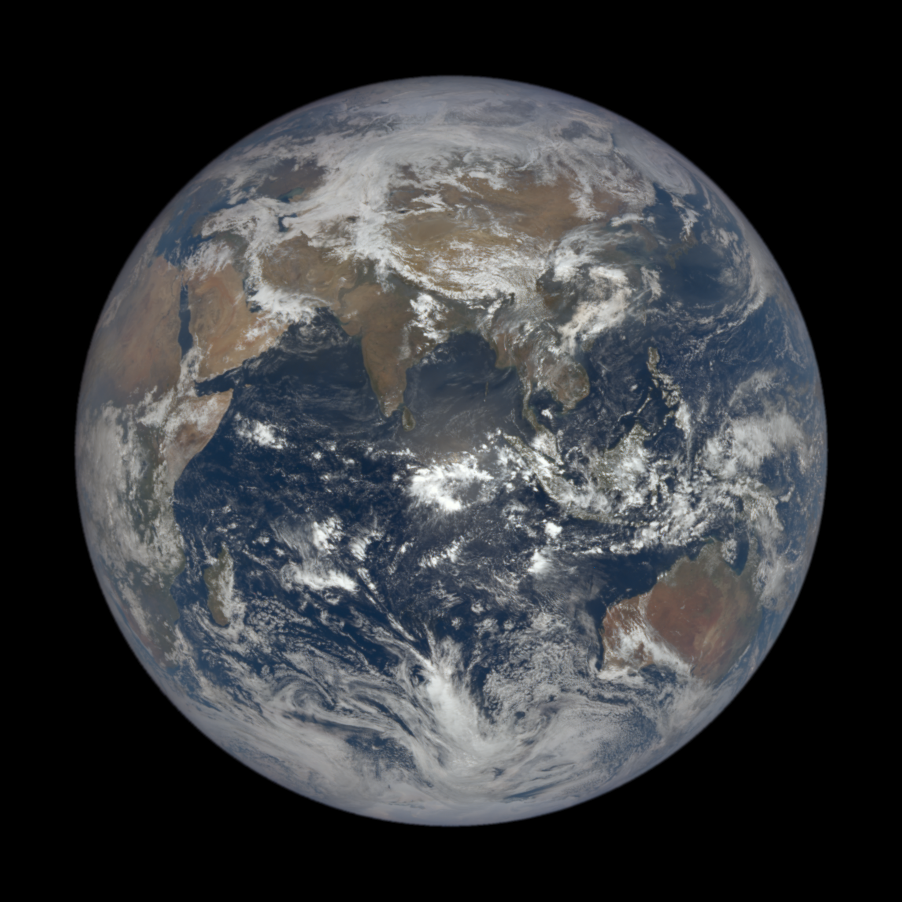
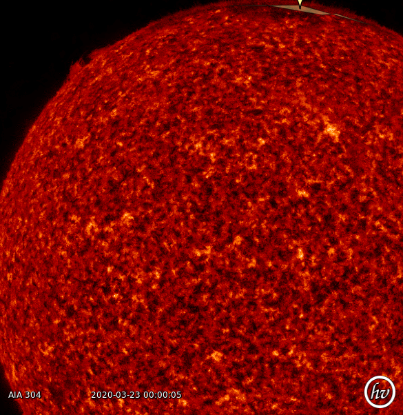

# mtsi-go

Get information about the Sun, Moon, and Earth using various APIs. Lunar data is displayed on the commandline, solar and earth data are retrieved as satellite images

## Install
```
go get github.com/louisbarrett/mtsi-go
go install github.com/louisbarrett/mtsi-go
```

## Usage
```
./mtsi-go 

  -date string (default 2 days ago)
        Date to pull data for in 2006-12-24 format
  -zone int

                00 - 03 Australia
                05 - 07 Africa
                08 - 09 South America
                10 - 11 USA
                12      Pacific Ocean
                 (default 6)
```
## Result

Running ./mtsi-go -date 2020/03/23 produces 
```
Days into cycle: 26.483297057360197
Current Moon Phase: Waning Crescent 🌔
Distance From Earth: 399586.9 kilometers
Lunar Illumination: 0.1
Distance from the sun 149049379.1057768 miles
Wrote solar image data to aten.png
Wrote earth image data to gaia.png
```
### Image of the earth taken 2020/03/21
</img>
### Image of the sun taken 2020/03/23
</img>


